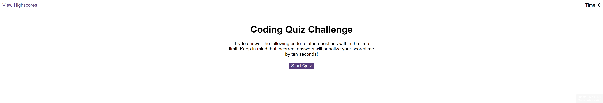

# Code Quiz
Timed coding quiz with multiple-choice questions.

&nbsp;&nbsp;&nbsp;&nbsp;&nbsp;&nbsp;

---
## Installation

No installation is required.
Click [here](https://lorettarehm.github.io/Code-Quiz/) to access the page.

## Usage 
The webpage includes a timer and a list of questions that will be displayed for the user to chose correct answer.
Each wrong answer subtracts ten seconds from the 60 initial seconds provided".

## Credits
* Trilogy Education Services
* [W3Schools](https://www.w3schools.com/)
* [MDN list-style](https://developer.mozilla.org/en-US/docs/Web/CSS/list-style)
* [Stack Overflow](https://stackoverflow.com/questions/16717019/adding-list-to-array-of-list-in-localstorage)
* [W3Schools Quiz JS](https://www.w3schools.com/quiztest/quiztest.asp?qtest=JS)

## [License](./LICENSE)
